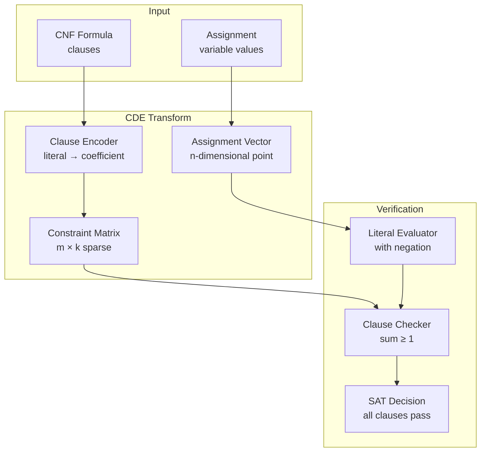
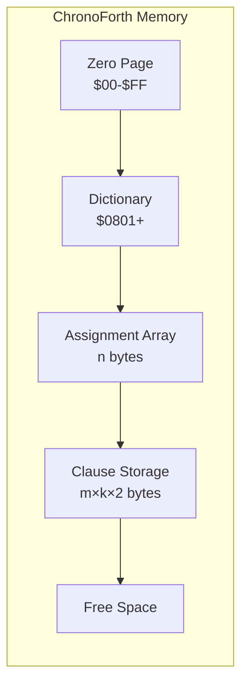
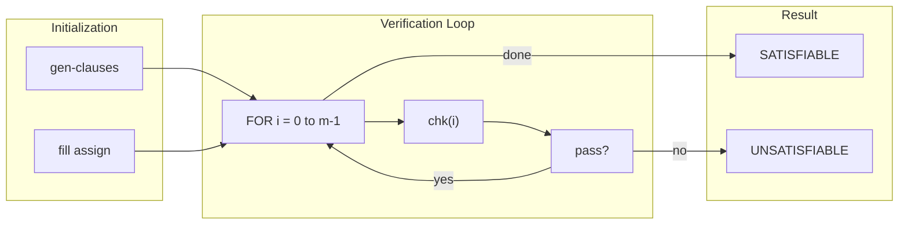
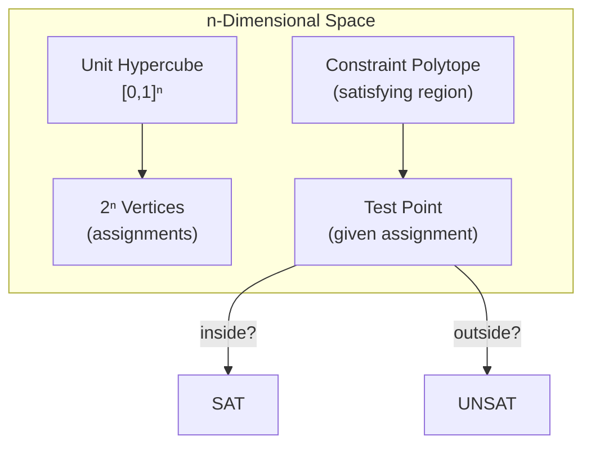

# Architecture: ChronoSAT

## System Overview

ChronoSAT implements Coleman Dimensional Encoding (CDE) for 3-SAT verification.
The system transforms Boolean satisfiability into geometric polytope membership
testing, achieving polynomial-time verification on candidate solutions.

### Component Diagram



## Core Algorithm

### The CDE Transform

Each 3-SAT clause becomes a linear inequality:

```text
Clause: (x₀ ∨ ¬x₁ ∨ x₂)
Inequality: x₀ + (1-x₁) + x₂ ≥ 1
Simplified: x₀ - x₁ + x₂ ≥ 0
```

### Verification Procedure

```forth
: sat? ( -- flag )
  m 0 do
    i chk 0= if       \ Check clause i
      0 unloop exit   \ UNSAT: clause failed
    then
  loop
  -1 ;                \ SAT: all clauses passed
```

## Component Breakdown

### Component 1: Literal Storage

**File Location:** `src/chronosat.fs`
**Responsibility:** Sparse clause storage with negation encoding
**Inputs:** Clause definitions
**Outputs:** Indexed literal access
**Dependencies:** None

```forth
\ Literal format: bit 15 = negation, bits 0-14 = var index
8000 constant neg-bit
7fff constant var-mask

\ Get literal for clause c, position p (0-2)
: lit@ ( clause pos -- literal )
  swap k * + 2* vars + @ ;
```

**Memory:** 6 bytes per clause (3 literals × 2 bytes each)

### Component 2: Literal Evaluator

**File Location:** `src/chronosat.fs`
**Responsibility:** Evaluate literal value under assignment
**Inputs:** Literal (with negation bit)
**Outputs:** 0 or 1
**Dependencies:** Assignment array

```forth
: eval ( literal -- 0|1 )
  dup var-mask and assign@   \ get assign[var & 0x7FFF]
  swap neg-bit and if        \ check negation bit
    0= if 1 else 0 then      \ NOT: 0->1, 1->0
  then ;
```

### Component 3: Clause Checker

**File Location:** `src/chronosat.fs`
**Responsibility:** Verify single clause satisfaction
**Inputs:** Clause index
**Outputs:** Boolean flag
**Dependencies:** Literal storage, evaluator

```forth
: chk ( clause -- flag )
  dup 0 lit@ eval           \ Evaluate literal 0
  over 1 lit@ eval +        \ Add literal 1
  swap 2 lit@ eval +        \ Add literal 2
  1 >= ;                    \ Sum ≥ 1?
```

**Complexity:** O(k) per clause, where k=3 for 3-SAT

### Component 4: SAT Verifier

**File Location:** `src/chronosat.fs`
**Responsibility:** Check all clauses
**Inputs:** Populated clause array, assignment
**Outputs:** SAT/UNSAT decision
**Dependencies:** Clause checker

**Complexity:** O(m × k) total operations

## SOLID Principles Applied

| Principle | Implementation |
|-----------|----------------|
| **S** (Single Responsibility) | Each word does one thing (eval, chk, sat?) |
| **O** (Open/Closed) | New clause generators don't modify core verifier |
| **L** (Liskov Substitution) | All evaluators follow ( literal -- 0\|1 ) contract |
| **I** (Interface Segregation) | Minimal API: lit@, eval, chk, sat? |
| **D** (Dependency Inversion) | Verifier depends on eval abstraction, not storage |

## Memory Layout



### Storage Requirements

| Component | Formula | 2048 vars, 1024 clauses |
|-----------|---------|-------------------------|
| Assignment | n bytes | 2,048 bytes |
| Clauses | m × k × 2 | 6,144 bytes |
| Code | ~500 bytes | 500 bytes |
| **Total** | | ~8.7 KB |

Available on C64: ~38 KB dictionary space

## Data Flow



## Geometric Interpretation



The key insight: Checking polytope membership is O(m × n), not O(2ⁿ).

---

*Standardized with [chronoboiler](https://github.com/the-chronomancer/chronoboiler) v1.0.0*
